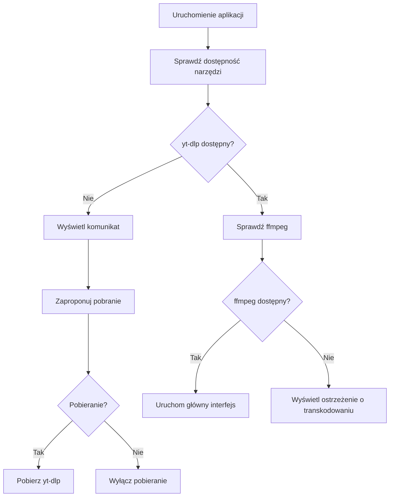
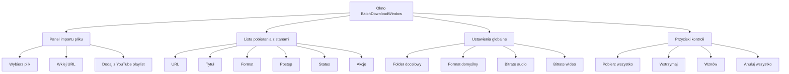

# Plan Rozwoju Aplikacji YouTube Downloader

## 1. Analiza Obecnego Stanu

### Obecna funkcjonalność

- **Pobieranie pojedynczych filmów** z YouTube (MP4, MKV, WebM, MP3, M4A)
- **Transkodowanie** z FFmpeg (kompresja wideo, zmiana bitrate)
- **Historia pobierań** z możliwością otwarcia folderu
- **Wielojęzyczność** (PL, EN, DE)
- **Logowanie** szczegółowe procesu pobierania

### Wymagania systemowe

- Windows 10/11
- .NET 10.0 Runtime
- yt-dlp.exe (wymagany ręcznie)
- ffmpeg.exe (wymagany ręcznie)

---

## 2. Proponowane Zmiany

### 2.1 Instalator z Automatycznym Pobieraniem Zależności

#### Cel

Ułatwienie instalacji i konfiguracji aplikacji poprzez automatyczne pobieranie wymaganych narzędzi.

#### Funkcjonalności

##### A) Utworzenie Instalatora (Inno Setup)

```
Plan:
├── Utworzenie skryptu instalatora (setup.iss)
├── Pakowanie aplikacji do pojedynczego pliku EXE
├── Automatyczne tworzenie skrótów na pulpicie i w menu Start
├── Opcja wyboru folderu instalacji
└── Rejestracja jako aplikacja domyślna dla protokołów youtube://
```

##### B) Automatyczne Pobieranie Zależności przy Pierwszym Uruchomieniu

```csharp
// Nowy serwis: DependencyDownloaderService
public class DependencyDownloaderService
{
    // Pobieranie yt-dlp.exe z GitHub Releases
    // Pobieranie ffmpeg.exe z gyan.dev
    // Sprawdzanie sum kontrolnych
    // Wersjonowanie zależności
    // Automatyczne aktualizacje przy nowszych wersjach
}
```

##### C) Sprawdzanie i Aktualizacja Narzędzi

```
Struktura:
├── Settings/                    # Nowy folder konfiguracyjny
│   ├── appsettings.json        # Konfiguracja aplikacji
│   ├── tools.json              # Wersje i ścieżki narzędzi
│   └── user.config             # Preferencje użytkownika
├── Tools/
│   ├── yt-dlp/                 # Katalog z wersjami yt-dlp
│   │   ├── current.exe -> v2024.01.01.exe
│   │   └── v2024.01.01.exe
│   └── ffmpeg/
│       ├── current.exe -> build.exe
│       └── build.exe
└── Logs/
    └── download-{date}.log
```

##### D) Mechanizm Aktualizacji



---

### 2.2 Pobieranie Wsadowe z Pliku

#### Cel

Możliwość importu listy URL z pliku tekstowego i automatyczne pobieranie wielu filmów.

#### Funkcjonalności

##### A) Import Linków z Pliku

```
Obsługiwane formaty:
├── Prosta lista (jeden URL na linię)
├── CSV (url,title,format)
├── JSON (array of objects with url property)
└── M3U playlist (opcjonalnie)
```

##### B) Nowy Interfejs Kolejki Pobierania



##### C) Zarządzanie Kolejką

```csharp
// Nowe modele danych
public class BatchDownloadItem
{
    public Guid Id { get; set; }
    public string Url { get; set; }
    public string? Title { get; set; }
    public DownloadFormat Format { get; set; }
    public DownloadState State { get; set; }
    public double Progress { get; set; }
    public string? ErrorMessage { get; set; }
    public int RetryCount { get; set; }
    public DateTime? AddedAt { get; set; }
    public DateTime? StartedAt { get; set; }
    public DateTime? CompletedAt { get; set; }
}

public class BatchDownloadSettings
{
    public string OutputFolder { get; set; }
    public DownloadFormat DefaultFormat { get; set; }
    public AudioBitrate DefaultAudioBitrate { get; set; }
    public int? DefaultVideoBitrate { get; set; }
    public EncodingMode EncodingMode { get; set; }
    public int MaxConcurrentDownloads { get; set; } = 2;
    public int RetryFailedItems { get; set; } = 3;
    public bool StopOnError { get; set; } = false;
}
```

##### D) Przetwarzanie Równoległe

```
Opcje przetwarzania:
├── Sekwencyjne (jeden po drugim)
├── Równoległe (max 2-3 jednocześnie)
└── Z priorytetami (opcjjalnie)
```

---

### 2.3 Pobieranie Playlist YouTube

#### Cel

Automatyczne wykrywanie playlist i możliwość pobierania wszystkich lub wybranych filmów.

#### Funkcjonalności

##### A) Automatyczne Wykrywanie Playlist

```csharp
// Regex do wykrywania typów URL
var playlistPatterns = new[]
{
    @"youtube\.com/playlist\?list=([a-zA-Z0-9_-]+)",      // Standardowa playlista
    @"youtube\.com/watch\?v=([a-zA-Z0-9_-]+)&list=([a-zA-Z0-9_-]+)", // Film z playlisty
    @"youtube\.com/@([a-zA-Z0-9_]+)/videos",               // Kanał - wszystkie filmy
    @"youtube\.com/channel/([a-zA-Z0-9_-]+)/videos",       // Kanał - wszystkie filmy
    @"youtube\.com/c/([a-zA-Z0-9_-]+)/videos",             // Kanał niestandardowy
};
```

##### B) Podgląd Playlisty przed Pobieraniem

```
Nowe okno: PlaylistPreviewWindow

Zawartość:
├── Lista wszystkich filmów w playliście
│   ├── Miniaturka
│   ├── Tytuł
│   ├── Czas trwania
│   ├── Data publikacji
│   └── Checkbox (zaznacz do pobrania)
├── Statystyki (ile zaznaczonych, szacowany rozmiar)
├── Ustawienia formatu dla całej playlisty
├── Opcja: Pobierz tylko nowe (sprawdź istniejące)
└── Przycisk: Rozpocznij pobieranie zaznaczonych
```

##### C) Filtrowanie i Sortowanie

```
Opcje filtrowania:
├── Tylko nowe (nie pobrane wcześniej)
├── Tylko HD (720p+)
├── Tylko audio (MP3)
├── Z zakresu dat
└── Z limitem liczby filmów

Sortowanie:
├── Data (najnowsze/najstarsze)
├── Popularność (najwyższe/najniższe)
├── Tytuł (alfabetycznie)
└── Czas trwania
```

##### D) Pobieranie z Postępem Globalnym

```
Progress bar dla playlisty:
├── Ogólny postęp (ile z X pobranych)
├── Postęp aktualnego filmu
├── Szacowany czas do końca
└── Lista błędów (jeśli wystąpiły)
```

---

## 3. Struktura Projektu po Rozszerzeniu

```
YoutubeDownloader/
├── App.xaml
├── App.xaml.cs
├── YoutubeDownloader.csproj
├── build.ps1                    # Skrypt budowania
├── setup.iss                    # Skrypt instalatora Inno Setup
│
├── Models/
│   ├── DownloadOptions.cs       # Istniejący
│   ├── DownloadFormat.cs        # Istniejący
│   ├── AudioBitrate.cs          # Istniejący
│   ├── VideoBitrateOption.cs    # Istniejący
│   ├── DownloadState.cs         # Istniejący
│   ├── DownloadProgressInfo.cs  # Istniejący
│   ├── BatchDownloadItem.cs     # NOWY
│   ├── BatchDownloadSettings.cs # NOWY
│   ├── PlaylistInfo.cs          # NOWY
│   ├── PlaylistItem.cs          # NOWY
│   └── AppSettings.cs           # NOWY
│
├── ViewModels/
│   ├── MainViewModel.cs         # Istniejący
│   ├── BatchDownloadViewModel.cs    # NOWY
│   ├── PlaylistPreviewViewModel.cs  # NOWY
│   └── SettingsViewModel.cs     # NOWY (opcjonalnie)
│
├── Views/
│   ├── MainWindow.xaml          # Istniejący
│   ├── MainWindow.xaml.cs       # Istniejący
│   ├── HistoryWindow.xaml       # Istniejący
│   ├── HistoryWindow.xaml.cs    # Istniejący
│   ├── BatchDownloadWindow.xaml     # NOWY
│   ├── BatchDownloadWindow.xaml.cs  # NOWY
│   ├── PlaylistPreviewWindow.xaml   # NOWY
│   ├── PlaylistPreviewWindow.xaml.cs# NOWY
│   └── SettingsWindow.xaml      # NOWY (opcjonalnie)
│
├── Services/
│   ├── YoutubeDownloadService.cs    # Istniejący
│   ├── HistoryService.cs            # Istniejący
│   ├── LocalizationService.cs       # Istniejący
│   ├── DependencyService.cs         # NOWY
│   ├── BatchDownloadService.cs      # NOWY
│   ├── PlaylistService.cs           # NOWY
│   └── SettingsService.cs           # NOWY
│
├── Infrastructure/
│   ├── LoggingService.cs    # Istniejący
│   ├── ProcessRunner.cs     # Istniejący
│   ├── HttpClientService.cs # NOWY (do pobierania zależności)
│   └── FileService.cs       # NOWY (operacje na plikach)
│
├── Converters/
│   ├── BoolConverters.cs    # Istniejący
│   └── Converters.cs        # NOWE konwertery
│
├── Resources/
│   ├── Languages/
│   │   ├── Dictionary-pl.xaml   # Istniejący
│   │   ├── Dictionary-en.xaml   # Istniejący
│   │   └── Dictionary-de.xaml   # Istniejący
│   └── Icons/                     # NOWY (ikony dla nowych funkcji)
│
└── Tools/                     # Katalog na narzędzia (tworzony przy uruchomieniu)
    ├── yt-dlp/
    │   └── yt-dlp.exe
    └── ffmpeg/
        └── ffmpeg.exe
```

---

## 4. Szczegółowy Plan Implementacji

### Etap 1: Modernizacja Infrastruktury

1. Utworzenie serwisu `DependencyService` do pobierania zależności
2. Utworzenie serwisu `SettingsService` do zarządzania ustawieniami
3. Aktualizacja `ProcessRunner` o obsługę pobierania plików
4. Dodanie konfiguracji appsettings.json

### Etap 2: Instalator i Automatyzacja

1. Utworzenie skryptu `setup.iss` dla Inno Setup
2. Dodanie mechanizmu sprawdzania aktualizacji narzędzi
3. Implementacja automatycznego pobierania przy pierwszym uruchomieniu
4. Dodanie strony ustawień w interfejsie

### Etap 3: Pobieranie Wsadowe

1. Utworzenie modeli `BatchDownloadItem` i `BatchDownloadSettings`
2. Utworzenie nowego okna `BatchDownloadWindow`
3. Implementacja importu z pliku (TXT, CSV, JSON)
4. Implementacja kolejki pobierania z równoległością
5. Dodanie kontrolek do MainWindow (przycisk "Pobieranie wsadowe")

### Etap 4: Obsługa Playlist

1. Utworzenie modeli `PlaylistInfo` i `PlaylistItem`
2. Utworzenie serwisu `PlaylistService` do pobierania metadanych
3. Utworzenie okna `PlaylistPreviewWindow`
4. Implementacja wykrywania typów URL (playlist/kanał/film)
5. Implementacja filtrowania i sortowania
6. Integracja z funkcją pobierania wsadowego

### Etap 5: Lokalizacja i Testowanie

1. Dodanie nowych stringów do słowników językowych
2. Testowanie na różnych wersjach Windows
3. Testowanie z różnymi formatami playlist
4. Optymalizacja i poprawki błędów

---

## 5. Wymagania Techniczne

### Zależności do Dodania

```xml
<!-- Wymagane pakiety NuGet -->
<PackageReference Include="Newtonsoft.Json" Version="13.0.3" />
<PackageReference Include="System.Text.Json" Version="8.0.0" />
```

### Aktualizacja csproj

```xml
<ItemGroup>
    <None Update="appsettings.json">
        <CopyToOutputDirectory>PreserveNewest</CopyToOutputDirectory>
    </None>
</ItemGroup>
```

---

## 6. Priorytety Implementacji

| Priorytet | Funkcjonalność | Opis |
|-----------|----------------|------|
| 1 | DependencyService | Automatyczne pobieranie narzędzi |
| 2 | Batch Download | Pobieranie wsadowe z pliku |
| 3 | Playlist Support | Obsługa playlist YouTube |
| 4 | Installer | Utworzenie instalatora |
| 5 | Settings Page | Strona ustawień w aplikacji |

---

## 7. Ryzyka i Ograniczenia

| Ryzyko | Opis | Rozwiązanie |
|--------|------|-------------|
| Zmiany w API YouTube | YouTube może zmienić strukturę playlist | Aktualizacje yt-dlp zazwyczaj rozwiązują problem |
| Rate Limiting | YouTube może ograniczyć zbyt szybkie pobieranie | Limit liczby równoległych pobierań |
| Duże playlisty | Tysiące filmów może spowolnić aplikację | Pagowanie i lazy loading |
| Blokowanie | Możliwe blokowanie przez YouTube | Użycie proxy (opcjonalne w przyszłości) |

---

## 8. Następne Kroki

1. [ ] Akceptacja planu przez użytkownika
2. [ ] Przejście do trybu Code i implementacja Etapu 1
3. [ ] Testowanie każdego etapu
4. [ ] Utworzenie dokumentacji
5. [ ] Kompilacja finalnego instalatora
